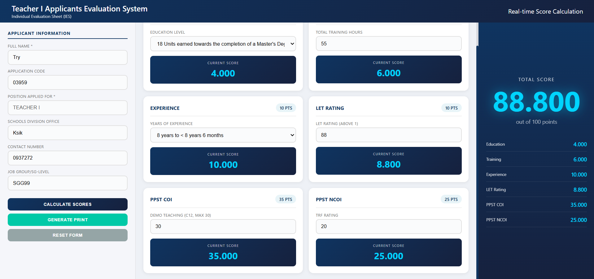
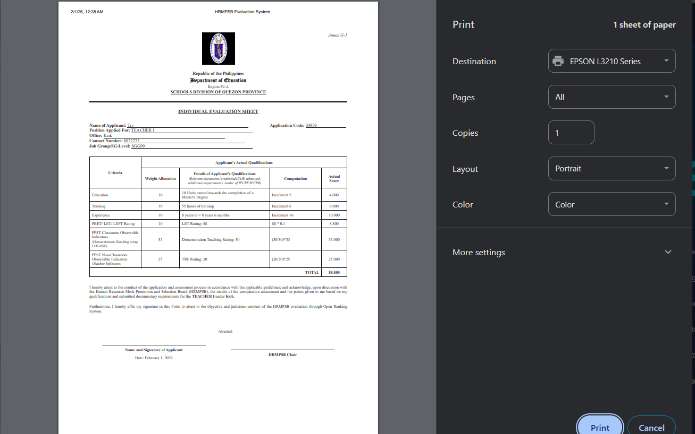
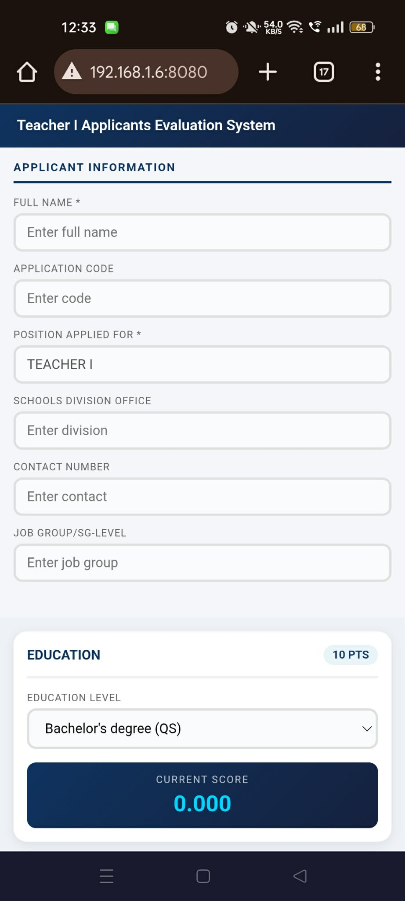
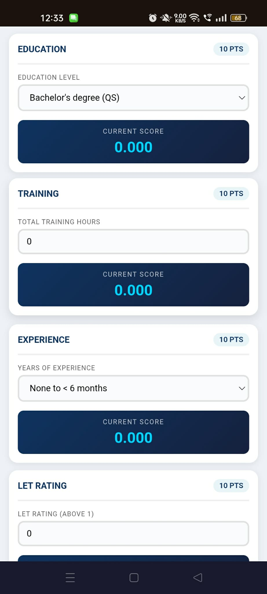
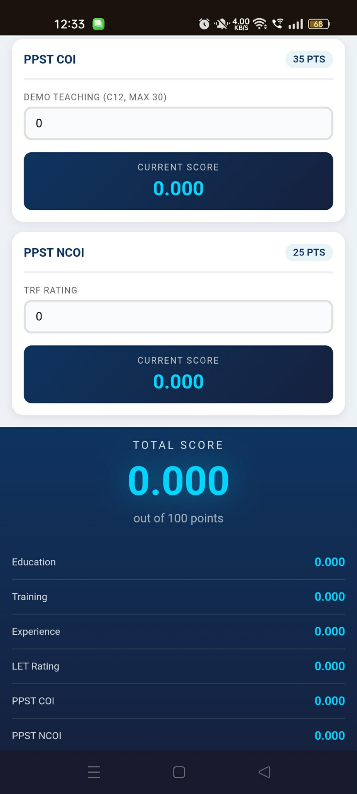
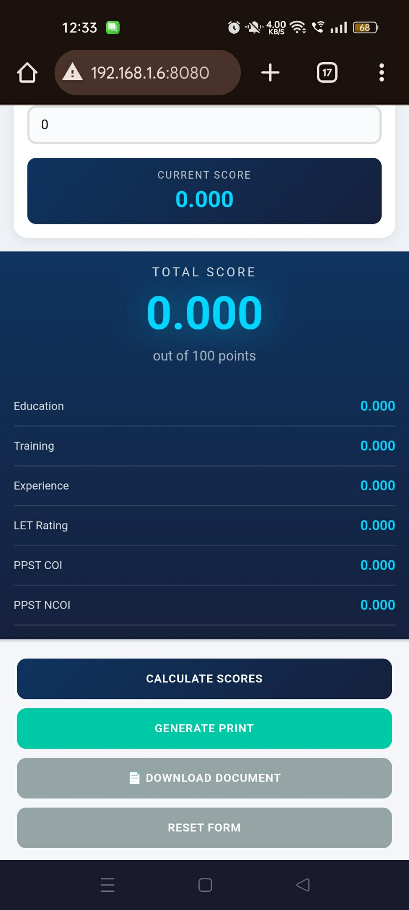

# 🎓 DepEd Teacher Applicant Evaluation System

<div align="center">


**Automated Teacher Applicant Scoring & Document Generation System**

*A comprehensive web application designed to streamline the teacher evaluation process for Department of Education divisions*

[](LICENSE)
[](https://github.com/your-username/DepEd-Teacher-Applicant-System)
[](https://github.com/your-username/DepEd-Teacher-Applicant-System)

[🚀 Quick Start](#-quick-start) • [📋 Features](#-features) • [🛠️ Installation](#️-installation) • [📖 Usage](#-usage) • [🔧 Configuration](#-configuration) • [📸 Screenshots](#-screenshots)

</div>

## 📖 About

The DepEd Teacher Applicant Evaluation System is a **government-compliant web application** that revolutionizes the teacher recruitment process by automating applicant scoring and generating print-ready evaluation documents. Built specifically for the Department of Education's Human Resource Merit Promotion and Selection Board (HRMPSB), this system eliminates manual calculations and paperwork, ensuring **fair, transparent, and efficient** evaluation of teacher applicants.

### 🎯 Mission

To modernize and streamline the teacher applicant evaluation process by providing:
- **Automated scoring** based on DepEd's comprehensive criteria
- **Print-ready documents** compliant with government standards
- **Real-time calculations** to reduce human error
- **Offline capability** for remote deployment
- **Secure local hosting** for data privacy

## ✨ Key Features

### 🏆 **Comprehensive Evaluation Criteria**
- **Education** (10 points) - From basic literacy to doctoral degrees
- **Training** (10 points) - Professional development hours
- **Experience** (10 points) - Teaching experience in 6-month intervals
- **LET Rating** (10 points) - Licensure Examination for Teachers scores
- **PPST Classroom Observable Indicators** (35 points) - Demonstration teaching
- **PPST Non-Classroom Observable Indicators** (25 points) - Teacher reflection

### 🚀 **Smart Automation**
- **Real-time score calculation** as you type
- **Automatic document formatting** for government standards
- **Instant print-ready generation** with proper headers and signatures
- **Mobile-responsive design** for field evaluations
- **No database required** - runs entirely in browser

### 🔒 **Government-Grade Security**
- **Local server deployment** - data never leaves your network
- **Secure file serving** with directory protection
- **Access control** and path restrictions
- **Offline operation** for sensitive data handling

### 📱 **User-Friendly Interface**
- **Modern, intuitive dashboard** with card-based layout
- **Mobile-optimized** for tablet and smartphone use
- **Professional print templates** with DepEd branding
- **One-click document generation** and printing

## 🚀 Quick Start

### Method 1: One-Click Local Server (Recommended)
1. **Download** the project files to your computer
2. **Double-click** `start-server.bat` to launch the local server
3. **Open your browser** and navigate to `http://localhost:8080`
4. **Start evaluating** applicants immediately!

### Method 2: Direct Browser Access
1. **Open** `index.html` directly in your web browser
2. **Works offline** - no internet connection required
3. **Perfect for** single-user evaluation

### Network Access for Multiple Users
1. **Start the server** using `start-server.bat`
2. **Note your IP address** displayed in the server console
3. **Other devices** can access via `http://YOUR_IP:8080`
4. **All users** can evaluate simultaneously in real-time

## 🛠️ Installation & Setup

### System Requirements
- **Windows 7 or later** (Server mode)
- **Python 3.x** (included with most Windows installations)
- **Any modern web browser** (Chrome, Firefox, Edge, Safari)
- **Network connection** (optional, for multi-device access)

### Step-by-Step Setup

#### 1. Download the Application
```bash
# Clone or download the project files
git clone https://github.com/your-username/DepEd-Teacher-Applicant-System.git
cd DepEd-Teacher-Applicant-System/server
```

#### 2. Launch the Server
```bash
# Windows users - simply double-click
start-server.bat

# Or run manually
python simple-server.py
```

#### 3. Access the Application
- **Local access:** `http://localhost:8080`
- **Network access:** `http://YOUR_IP:8080`

#### 4. Start Evaluating
1. Enter applicant information
2. Input evaluation criteria
3. Watch scores calculate automatically
4. Generate print-ready documents

## 📋 Usage Guide

### Basic Workflow

#### 1. **Applicant Information Entry**
- Full name (required)
- Application code
- Position applied for (defaults to Teacher I)
- Schools Division Office
- Contact number
- Job Group/SG-Level

#### 2. **Criteria Evaluation**
- **Education Level:** Select from comprehensive dropdown
- **Training Hours:** Input total professional development hours
- **Experience:** Choose years of teaching experience
- **LET Rating:** Enter licensure exam score
- **PPST COI:** Input demonstration teaching scores
- **PPST NCOI:** Enter teacher reflection scores

#### 3. **Score Calculation**
- **Automatic calculation** as you input data
- **Real-time updates** in the sidebar
- **Breakdown display** of all criteria scores
- **Total score** out of 100 points

#### 4. **Document Generation**
- **Click "Generate Print"** for preview mode
- **Professional formatting** with DepEd headers
- **Print-ready layout** for official documents
- **Download option** for digital storage

### Advanced Features

#### **Multi-Device Evaluation**
- **Server mode** enables multiple evaluators
- **Real-time collaboration** on the same network
- **Mobile access** for field evaluations
- **Tablet support** for paperless assessments

#### **Print Management**
- **Government-compliant formatting**
- **DepEd branding and headers**
- **Signature lines** for applicants and HRMPSB Chair
- **Automatic date insertion**
- **Professional document layout**

## 🔧 Configuration

### Server Configuration
The system uses a lightweight Python server with built-in security:

```python
# Server settings (simple-server.py)
PORT = 8080
HOST = '0.0.0.0'  # Allows network access
DIRECTORY = './'   # Server root directory
```

### Customization Options
- **Port modification:** Edit `simple-server.py`
- **Branding updates:** Modify `assets/css/main.css`
- **Criteria adjustments:** Edit `assets/js/script.js`
- **Document templates:** Update `index.html` print section

### Security Features
- **Directory listing disabled**
- **Parent directory access blocked**
- **File type restrictions**
- **Path traversal protection**
- **Access logging** (optional)

## 📸 Screenshots

### Main Dashboard

*Modern, intuitive dashboard with real-time score calculation*

### Print Preview

*Professional government-compliant document formatting*

### Mobile View

| Screenshot 1 | Screenshot 2 | Screenshot 3 |
|--------------|--------------|--------------|
|  |  |  |
| *Forms Input* | *Forms Input* | *Applicant entry* |

| Screenshot 4 | Screenshot 5 |
|--------------|--------------|
|  |  |
| *Evaluation criteria* | *Score Calculation |

## 🏗️ Technical Architecture

### Frontend Technologies
- **HTML5** - Semantic markup and structure
- **CSS3** - Modern styling with responsive design
- **JavaScript (ES6+)** - Dynamic functionality and calculations
- **Print CSS** - Professional document formatting

### Backend Infrastructure
- **Python 3.x** - Lightweight HTTP server
- **Custom security layer** - Access control and protection
- **Static file serving** - Efficient asset delivery
- **Cross-platform compatibility** - Windows, macOS, Linux

### Data Handling
- **Client-side processing** - No server database required
- **Local storage** - Optional data persistence
- **Print generation** - Browser-native printing
- **Export capabilities** - Document download options

## 📊 Evaluation Criteria Breakdown

| **Criteria** | **Points** | **Description** |
|--------------|------------|-----------------|
| **Education** | 10 pts | Academic qualifications from basic literacy to doctoral degrees |
| **Training** | 10 pts | Professional development and training hours completed |
| **Experience** | 10 pts | Teaching experience measured in 6-month intervals |
| **LET Rating** | 10 pts | Licensure Examination for Teachers score |
| **PPST COI** | 35 pts | Classroom Observable Indicators (Demonstration Teaching) |
| **PPST NCOI** | 25 pts | Non-Classroom Observable Indicators (Teacher Reflection) |
| **TOTAL** | **100 pts** | **Comprehensive applicant evaluation** |

## 🔒 Security & Compliance

### Data Privacy
- **Local deployment** - Data never leaves your network
- **No cloud storage** - Complete data control
- **Offline capability** - No internet dependency
- **Secure file serving** - Protected access controls

### Government Compliance
- **DepEd formatting standards** - Official document layouts
- **HRMPSB requirements** - Merit promotion compliance
- **Print-ready documents** - Government paper standards
- **Signature protocols** - Official attestation procedures

## 🚀 Performance & Scalability

### System Performance
- **Lightweight footprint** - Minimal resource usage
- **Fast response times** - Instant score calculations
- **Concurrent users** - Multiple evaluators supported
- **Mobile optimization** - Efficient on all devices

### Scalability Features
- **Network deployment** - School-wide access
- **Browser compatibility** - Works on all modern browsers
- **Offline operation** - No internet dependency
- **Cross-platform** - Windows, macOS, Linux support

## 🛠️ Troubleshooting

### Common Issues & Solutions

#### **Server Won't Start**
```bash
# Check Python installation
python --version

# Verify port availability
netstat -an | findstr 8080

# Run as Administrator (if needed)
```

#### **Network Access Issues**
- **Check firewall settings** - Allow Python through Windows Firewall
- **Verify same network** - All devices must be on the same WiFi/network
- **Use correct IP** - Check server output for your IP address

#### **Print Problems**
- **Update browser** - Ensure latest browser version
- **Check print settings** - Use "Print Background Graphics"
- **Try different browser** - Chrome/Firefox recommended

#### **Mobile Issues**
- **Use landscape orientation** - Better mobile experience
- **Update browser app** - Latest mobile browser versions
- **Check network connection** - For server mode access


## 🤝 Contributing

We welcome contributions to improve the DepEd Teacher Applicant Evaluation System!

### How to Contribute
1. **Fork the repository**
2. **Create a feature branch** (`git checkout -b feature/amazing-feature`)
3. **Commit your changes** (`git commit -m 'Add amazing feature'`)
4. **Push to the branch** (`git push origin feature/amazing-feature`)
5. **Open a Pull Request**

### Development Guidelines
- **Follow DepEd standards** for government compliance
- **Maintain responsive design** for all device types
- **Test thoroughly** across different browsers
- **Document changes** in commit messages and README

## 📄 License

This project is licensed under the MIT License - see the [LICENSE](LICENSE) file for details.

### Government Usage
- **Free for educational institutions**
- **Open source for government agencies**
- **Customizable for specific division requirements**
- **Commercial use requires permission**

## 🙏 Acknowledgments

- **Department of Education (DepEd)** - For the evaluation framework
- **HRMPSB Members** - For requirements and feedback
- **School Division IT Teams** - For testing and deployment
- **Teacher Applicants** - For providing valuable user feedback

## 📞 Contact & Support

### Project Maintainers
- **Primary Developer:** Earl Jann Rivera
- **Email:** earlrivera00@gmail.com


### Technical Support
- **Server Issues:** Contact your IT Department
- **User Training:** Schedule with HRMPSB Coordinator
- **Feature Requests:** Submit via GitHub Issues

---

<div align="center">

**🇵🇭 Proudly serving the Philippine Education System**

*Empowering fair and efficient teacher recruitment through technology*

[⬆️ Back to Top](#-deped-teacher-applicant-evaluation-system)

</div>
